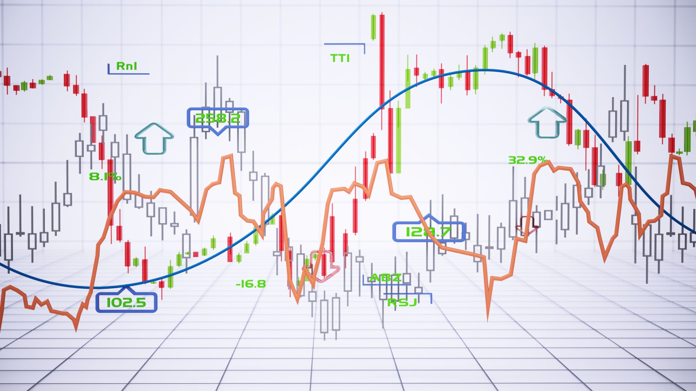

# [121. Best Time to Buy and Sell Stock](https://leetcode.com/problems/best-time-to-buy-and-sell-stock/)

## 1. Problem Statement

You are given an array `prices` where `prices[i]` is the price of a stock on the `i-th` day. The goal is to maximize your profit by choosing a **single day** to buy one stock and choosing a **different day in the future** to sell it.

Return the maximum profit you can achieve from this transaction. If no profit is possible, return `0`.

---

## 2. Intuition

A common brute-force approach is to use nested loops. The outer loop iterates through each day as a potential "buy" day, and the inner loop iterates through all subsequent days as a potential "sell" day. For each `(buy, sell)` pair, we calculate the profit and keep track of the maximum. This works, but its $O(n^2)$ time complexity is too slow for large inputs, resulting in a "Time Limit Exceeded" (TLE) error.

The key to an optimal solution is to realize that we can find the maximum profit in a single pass ($O(n)$). At any given point in time, the maximum profit is simply the **current price minus the minimum price seen so far.**

We can iterate through the `prices` array while maintaining just two variables:

1.  `minPrice`: The lowest stock price encountered up to the current day.
2.  `maxProfit`: The maximum profit found so far.

As we iterate through the prices day by day, we first check if the current price is a new `minPrice`. Then, we calculate the potential profit if we were to sell on the current day (`currentPrice - minPrice`). If this potential profit is greater than our `maxProfit`, we update it. This is a simple and elegant one-pass solution.

---

## 3. Algorithm

1.  Initialize a variable `minPrice` to a very large number (or to the first element in the array, `prices[0]`).
2.  Initialize a variable `maxProfit` to `0`.
3.  Iterate through the `prices` array, starting from the first element.
4.  For each `price` in the array:
    a. **Update the minimum price:** Check if the current `price` is less than `minPrice`. If it is, update `minPrice = price`.
    b. **Update the maximum profit:** Calculate the potential profit: `currentProfit = price - minPrice`. Check if `currentProfit` is greater than `maxProfit`. If it is, update `maxProfit = currentProfit`.
5.  After the loop finishes, `maxProfit` will hold the highest possible profit. Return `maxProfit`.

---

## 4. Complexity Analysis

- **Time Complexity:** $O(n)$
  - We iterate through the `prices` array exactly once, performing a few constant-time operations at each step.

- **Space Complexity:** $O(1)$
  - We only use two variables (`minPrice` and `maxProfit`) to store our state, regardless of the size of the input array. This is constant extra space.
