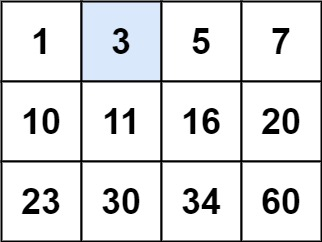

# [74. Search a 2D Matrix](https://leetcode.com/problems/search-a-2d-matrix/)

## 1. Problem Statement

You are given an `m x n` integer matrix `matrix` with the following two properties:

1.  Each row is sorted in non-decreasing order.
2.  The first integer of each row is greater than the last integer of the previous row.

Given an integer `target`, return `true` if `target` is in `matrix` or `false` otherwise. You must write a solution with $O(\log(m \cdot n))$ time complexity.

## 

## 2. Intuition

The problem's properties and the required time complexity are massive clues. The fact that each row is sorted and builds upon the previous row means that if we were to "flatten" the matrix into a single list, that list would be perfectly sorted. The $O(\log(m \cdot n))$ time complexity requirement strongly suggests that we should use **Binary Search**.

The core idea is to perform a binary search not on a physical 1D array, but on a **"virtual" 1D array** representing the `m x n` matrix. Our search space will be from index `0` to `(m * n) - 1`.

The main challenge is to map an index from our virtual 1D array (let's call it `mid`) back to the `[row][col]` coordinates of the actual 2D matrix. This can be done with simple division and modulo arithmetic. If our matrix has `N` columns, the mapping is:

- `row = mid / N`
- `col = mid % N`

With this mapping formula, we can run a standard binary search. We calculate our `mid` index, convert it to `[row][col]`, check the value, and then adjust our `left` or `right` pointers in the virtual 1D space accordingly.

---

## 3. Algorithm

1.  Handle the edge case of an empty or null matrix.
2.  Get the dimensions of the matrix: `m` (number of rows) and `n` (number of columns).
3.  Initialize two pointers for binary search on the virtual array: `left = 0` and `right = (m * n) - 1`.
4.  Start a `while` loop that continues as long as `left <= right`.
5.  Inside the loop, calculate the virtual midpoint: `mid = left + (right - left) / 2`.
6.  **Map to 2D coordinates:** Convert the `mid` index to its `[row][col]` equivalent using the number of columns `n`:
    - `row = mid / n`
    - `col = mid % n`
7.  Get the value at this position: `midValue = matrix[row][col]`.
8.  Compare `midValue` with the `target`:
    - If `midValue == target`, the element is found. Return `true`.
    - If `midValue < target`, the target must be in the right half. Update `left = mid + 1`.
    - If `midValue > target`, the target must be in the left half. Update `right = mid - 1`.
9.  If the loop finishes, the target was not found in the matrix. Return `false`.

---

## 4. Complexity Analysis

- **Time Complexity:** $O(\log(m \cdot n))$
  - We are performing a single binary search on a total of `m * n` elements. Each step reduces the search space by half, which is the definition of logarithmic time complexity.

- **Space Complexity:** $O(1)$
  - The algorithm uses a fixed number of variables for pointers and dimensions. The space required is constant and does not depend on the size of the input matrix.
